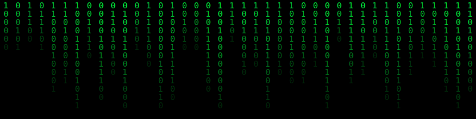

<div align="center">




```
> WAKE UP...
> THE MATRIX HAS YOU...
> FOLLOW THE WHITE RABBIT.
```


</div>

<p align="center">
  
</p>

---

<div align="center">
  <h2>🟢 WHO AM I?</h2>
</div>

```diff
+ I do not consider myself a software developer in the traditional sense.
+ Programming, for me, has always been a tool rather than an identity.

+ I am an independent researcher with a strong interest in Artificial
+ Intelligence, Blockchain systems, philosophy, and the way human
+ experience shapes understanding.

+ Most of my work emerges from curiosity, necessity, and the pursuit
+ of better questions rather than predefined answers.

+ I believe that experience completes knowledge, and that understanding
+ often begins where certainty ends.
```

---

<div align="center">
  <h2>🟢 FIELDS OF INQUIRY</h2>
</div>

<table align="center">
<tr>
<td>

```
[■] Artificial Intelligence Research
[■] Blockchain Systems & Decentralized Architectures
[■] Agentic AI & Automation
[■] Cognitive Science
[■] Philosophy & Human Experience
[■] Literature and Narrative Structures
[■] Web-based Interactive Experiences
```

</td>
</tr>
</table>

---

<div align="center">
  <h2>🟢 PERSONAL MANIFESTO</h2>
</div>

> ```
> I have learned to trust curiosity more than certainty,
> experience more than theory,
> and questions more than answers.
> ```

I believe that good technology rarely starts with technology itself. It often starts with philosophy, observation, and the willingness to admit that our current understanding may be incomplete.

---

<div align="center">
  <h2>🟢 CURRENT OBSESSIONS</h2>

  
  
  
  
  
  

</div>

---

<div align="center">
  <h2>🟢 TOOLS I USE TO THINK</h2>
</div>

<table align="center">
<tr>
<th>Research & Automation</th>
<th>Programming</th>
<th>Infrastructure</th>
<th>Exploration</th>
</tr>
<tr>
<td valign="top">

  
  


</td>
<td valign="top">

  
  


</td>
<td valign="top">

  


</td>
<td valign="top">

  
  


</td>
</tr>
</table>

---

<div align="center">
  <h2>🟢 SELECTED EXPERIMENTS</h2>
</div>

<details open>
<summary><b>💻 Personal Python Utilities</b></summary>
<br>

- Built personal-purpose Python applications, including custom utility tools and workflow automation scripts.
- Developed a personal document indexing/numbering utility and other problem-driven software experiments.

</details>

<details open>
<summary><b>🤖 AI Experimentation</b></summary>
<br>

- Modified and adapted open-source AI projects for personal research purposes.
- Experimented with MuseTalk/Whisper-based workflows and lip-sync generation pipelines through customized implementations.

</details>

<details open>
<summary><b>⛓️ Blockchain Research</b></summary>
<br>

- Participated in architectural analysis and problem-solving for decentralized systems.
- Focused primarily on understanding the nature, constraints, and emergent behavior of blockchain networks.

</details>

<details open>
<summary><b>🌐 Interactive Web Experiences</b></summary>
<br>

- Designed and developed a museum-inspired virtual showroom experience using Three.js, allowing first-person exploration of 3D environments and objects.
- Created interactive web experiences and experimental landing pages.

</details>

<details open>
<summary><b>🕸️ Agentic Automation</b></summary>
<br>

- Designed complex multi-agent workflow systems integrating messaging platforms, AI services, cloud storage, and structured data pipelines.

</details>

---

<div align="center">
  <h2>🟢 BEYOND TECHNOLOGY</h2>

  
  
  
  
  <br>
  
  
  <br>
  
  
  

</div>

---

<div align="center">

```
"Perhaps to become a better codemaster, one must first become a better philosopher."
```



</div>
